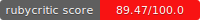

# Pasos para ejecutar el juego



1. Descargar el repositorio
2. Instalar las gemas necesarias para el proyecto, escribiendo el siguiente comando:
```
bundle install
```
**En caso de que no tengas bundle instalado solo escribe lo siguiente:
```
gem install bundler
```

3. Desde terminal escribir:
```
ruby game.rb
```

## Instrucciones del juego
1. Las teclas de movimiento son:
* e - Arriba
* d - Abajo
* s - Izquierda
* f - Derecha

** Una vez que hayas ingresado una tecla de movimiento, presiona enter, para que puedas moverte.

2. Tu eres Pacman 
* " v "

3. Tu objetivo en el juego, es comer todos los puntos que hay en el laberinto, cada punto se suma para tu puntuacion.
4. Las paredes que conforman el laberinto no se pueden atravesar, sin embargo, los bordes del mapa si, para que tengas esto en cuenta
5. Una vez que completas el nivel el juego te cambiara al siguiente nivel.

6. Si deseas salir del juego, solo escribe 'quit', y el juego terminara.

### Integrantes
- Andrea (Andisima)
- Raúl Almanza (Ruli-AlSe)
- Alejandro (alx1313)